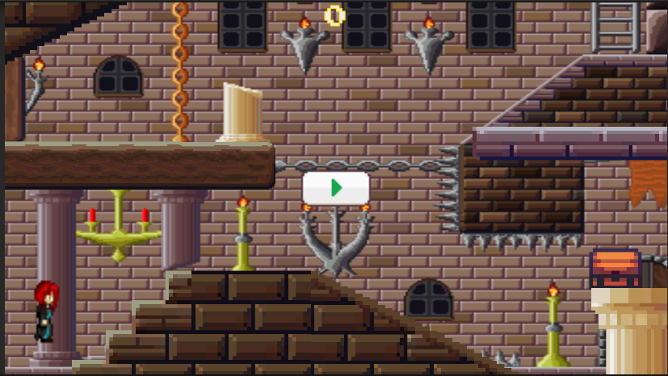
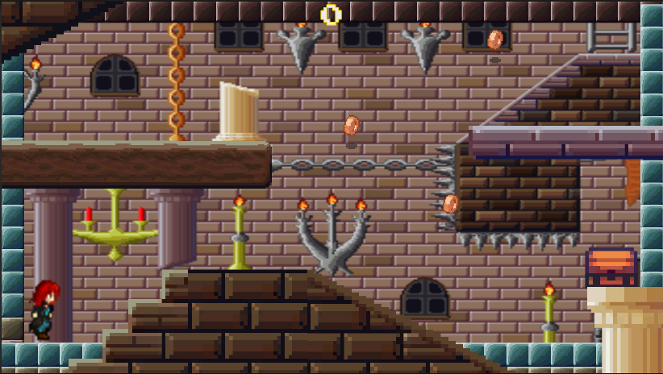
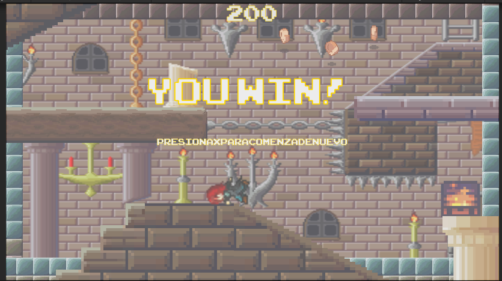
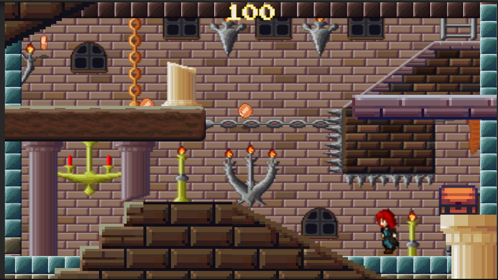

# PremioCofre-Unity

Brief project description.

## Game Idea
The game is a side-scrolling game where the player character (Jogador) can move left or right and jump. The objective of the game is to collect coins scattered throughout the level. When enough coins are collected, a chest is unlocked, and a victory screen is displayed.

## Game Proposal
The game proposes a challenge of skill and reflexes. The player must control the character (Jogador) to move and jump, avoiding obstacles and collecting coins. The game has a limit of three coins in the level at any given time, and each time a coin is collected, a new coin is generated at a random location. Once the player has collected enough coins (currently set to 200 points), the victory screen is displayed, and the chest opens.

## Screenshots

*Image 1. Game Start*

*Image 2. Player State "Run" and "Jump"*

*Image 3. Game State with Coin Rewards*

*Image 4. Player Winning and Chest Open*

## How to Use the Project

1. Clone or download the project to your computer.
2. Open Unity and select "Open Project".
3. Navigate to the project folder and select the main folder.
4. Wait for Unity to import all the assets and project configurations.
5. Once imported, select the main game scene.
6. Click the play button to start the game.

## Sprites Attribution

The selected sprites were obtained from Open Game Art and are as follows:
- Image 1: [Chest Effect](https://opengameart.org/content/a-platformer-in-the-forest)
- Image 2: [Background, Walls, Floor, and Obstacles](https://opengameart.org/content/pixel-art-castle-tileset)
- Image 3: [Coin Rewards](https://opengameart.org/content/pixel-art-castle-tileset)
